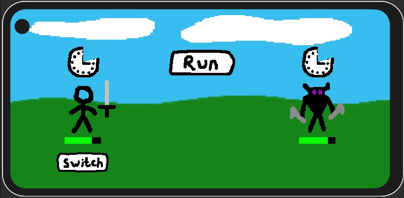

# Idle-Test
Idle RPG project for a test task

Starting area allows player to heal the player character (HEAL button) and enter combat (FIGHT button).
Combat area allows player to escape back to starting area (RUN button) and switch weapons (SWITCH button), each with their own attack speed (bow is slower).

Combat is automatic:
1) Player character and enemy will prepare to attack (clock indicator shows the remaining time)
2) Once preparation is complete, attack will be executed, depending on attack speed. Enemy attack speed is two times faster than their preparation speed
3) If player presses the SWITCH button, then switch will be carried out only in preparation stage or after a player attack
4) Once enemy health is depleted, new enemy will spawn, depending on it's spawn chance
5) Once player health is depleted, they will be returned to starting area
